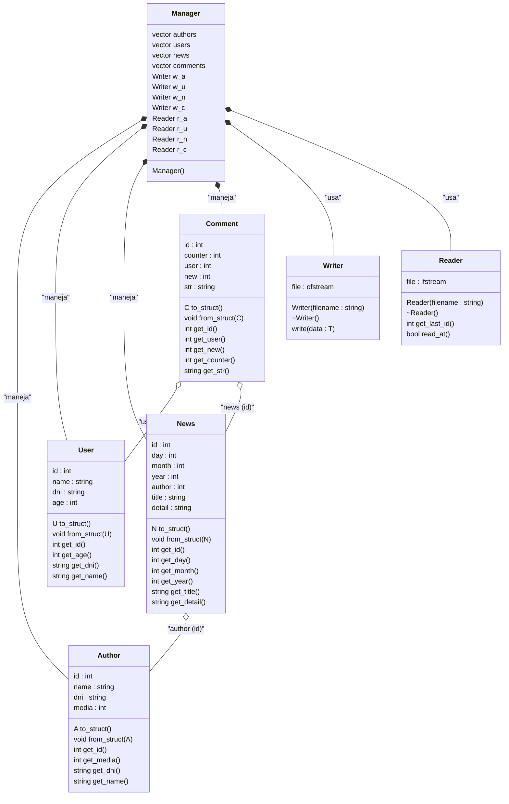

```mermaid
classDiagram
  class Author {
    id : int
    name : string
    dni : string
    media : int
    A to_struct()
    void from_struct(A)
    int get_id()
    int get_media()
    string get_dni()
    string get_name()
  }
  class User {
    id : int
    name : string
    dni : string
    age : int
    U to_struct()
    void from_struct(U)
    int get_id()
    int get_age()
    string get_dni()
    string get_name()
  }
  class News {
    id : int
    day : int
    month : int
    year : int
    author : int
    title : string
    detail : string
    N to_struct()
    void from_struct(N)
    int get_id()
    int get_day()
    int get_month()
    int get_year()
    string get_title()
    string get_detail()
  }

  class Comment {
    id : int
    counter : int
    user : int
    new : int
    str : string
    C to_struct()
    void from_struct(C)
    int get_id()
    int get_user()
    int get_new()
    int get_counter()
    string get_str()
  }

  class Writer {
    file : ofstream
    Writer(filename : string)
    ~Writer()
    write(data : T)
  }

  class Reader {
    file : ifstream
    Reader(filename : string)
    ~Reader()
    int get_last_id()
    bool read_at()
  }

  class Manager {
    vector<Author> authors
    vector<User> users
    vector<News> news
    vector<Comment> comments
    Writer<Author> w_a
    Writer<User> w_u
    Writer<News> w_n
    Writer<Comment> w_c
    Reader<Author> r_a
    Reader<User> r_u
    Reader<News> r_n
    Reader<Comment> r_c
    Manager()
  }

  Manager *-- Author : "maneja"
  Manager *-- User : "maneja"
  Manager *-- News : "maneja"
  Manager *-- Comment : "maneja"
  Manager *-- Writer : "usa"
  Manager *-- Reader : "usa"
  News o-- Author : "author (id)"
  Comment o-- User : "user (id)"
  Comment o-- News : "news (id)"
 
```

